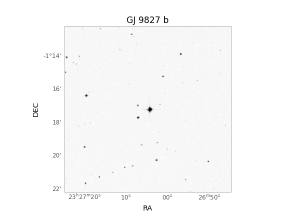
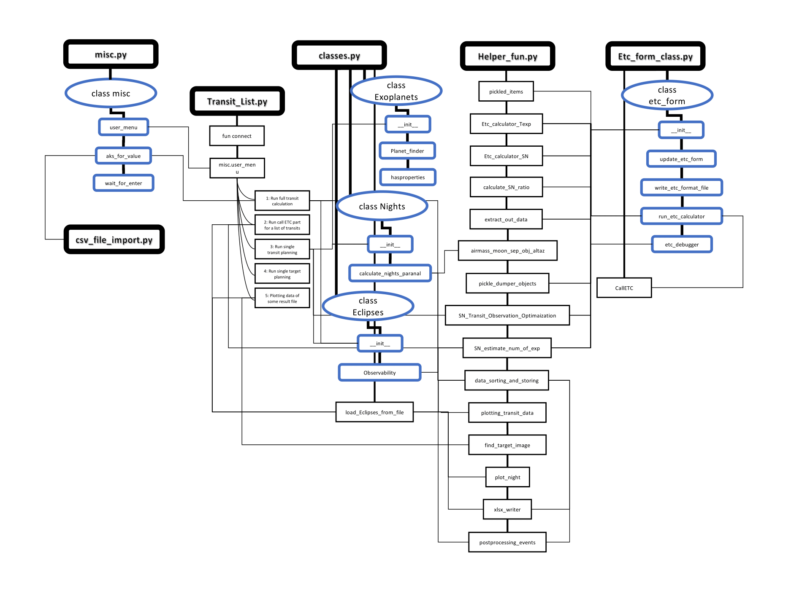
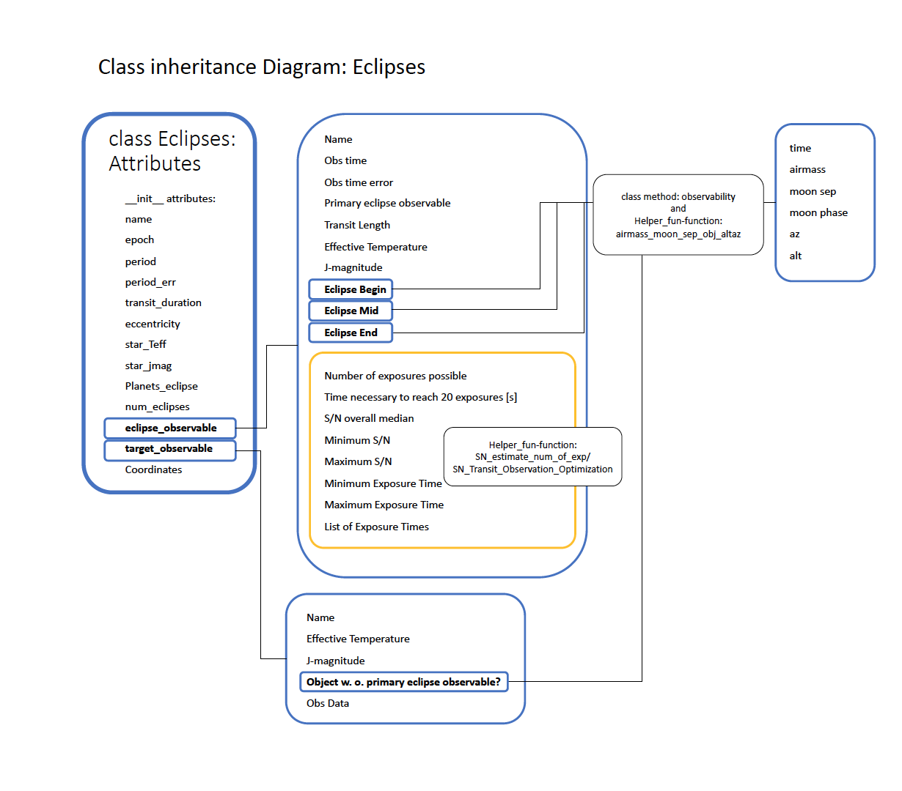

# CRIRES-planning-tool documentation

Version 15. September 2020


#### Introduction:

CRIRES-planning-tool is a software tool developed over the course of my Master's project under the supervision of Prof. Dr. Nikolai Piskunov and Dr. Andreas Korn, in collaboration with Dr. Alexis Lavail

The CRIRES-planning-tool is intended to be used to plan transit observations of exoplanets for CRIRES+, the new cross-dispersed high-resolution infrared spectrograph for the ESO VLT [CRIRES+](https://www.eso.org/sci/facilities/develop/instruments/crires_up.html). Observaton of exoplanets can be planned in two ways. Single candidate by name in a given timespan or by using constraints for observable candidates by CRIRES+, which can be loaded from the file: Nasa_Archive_Selection.txt (see section: **Constraints for Candidates**). The known exoplanets fulfilling these constraints are downloaded from Nasa Exoplanet Archive and each candidate is checked for its observability from Cerro Paranal, Chile for during a given time frame. Each observable candidate is checked for a minimum signal-to-noise ratio (S/N)≥100 during 20 exposures. This constrain will likely be updated in the future to distinguish between observations of super-Earth's or giant planets, and sensitive to the host star spectral type. Each exposure is related to its total exposure time, calculated from the detector integration time multiplied with the number of detector integrations: (TEXP = DIT x NDIT) and NDIT is optimized to be within 16≤NDIT≤32 for each exposure (see section: **Exposure Time Calculator**). Candidates with observability of the complete transit are added to the observation list and further information can be found in the output excel files (see section: **Result files**). The tool uses two ways to calculate the number of exposures possible during a single transit. The details are described in my master thesis: *Planning observations of terrestrial Exoplanetsaround M type Stars with CRIRES+*, section *3.3 Signal-to-noise ratio and the Exposure Time Calculator*. The tool comes with plotting tools and a commandline window to access its functionalities. This document shall give an overview about the functionalities, accessibility, structure,  installation, and further development possibilities of the CRIRES-planning-tool. Code documentation can be found in **Code documentation** and a dependency tree is presented in **Dependencies**. The methods used for astronomical calculations are used from the astropy and astroplan library, about which documentation can be found here: [astroplan](https://astroplan.readthedocs.io/en/latest/), [astropy](https://docs.astropy.org/en/stable/).  


#### Installation:

1. Navigate to your chosen directory to install the CRIRES-planning-tool.

2. Download github repository: 
   `git clone https://github.com/jonaszubindu/CRIRES-planning-tool`

3. Setup a virtual environment to install the correct packages to run the planning tool

   `cd CRIRES-planning-tool/python`

   `pip install virtualenv`

   `virtualenv --python python3.7 [name of your venv]`

   activate your virtual environment:

   `source [name of your venv]/bin/activate`

   install the requirements to run CRIRES-planning-tool stored in requirements.txt

   `pip  install -r requirements.txt`

   after you are done with running CRIRES-planning-tool use 

   `deactivate`

   to deactivate the virtual environment. 

4. Create directories for data storage:

   `mkdir Plots`

5. To run CRIRES-planning-tool run go into the p

   `./Transit_List.py`

   If ./Transit_List.py has not the proper rights to be run, use

   `chmod +x Transit_List.py`

   

Everytime you use the CRIRES-planning-tool, you should update the repository with

`git pull`

and run the tool in your virtual environment, by activating it and installing the requirements with pip.

`source [name of your venv]/bin/activate`

`pip  install -r requirements.txt`


#### Commandline Menu

Running Transit_List.py presents the following commandline window with options:


1. Runs a complete check of all available candidates fulfilling the constraints from Nasa_Archive_Selection.txt for a certain timescale. The tool asks for the starting date and the number of days to run the candidate list for and asks if the ETC part should also be run. Final results can only be optained by running the ETC part as well.
2. Runs the ETC part, where each observation of each observable candidate is checked for the possibiliy of 20 exposures with each one of them reaching S/N≥100 from a stored picklefile. This can be used for instance if something during the ETC part running option 1 goes wrong, and one wants to continue from where the problem occured during the first run.
3. Checks the observability of a single candidate by name for a certain timeframe.
4. Other targets can be run in the same way as exoplanetary candidates. However, this feature is not included yet.
5. Make plots from stored datafile from \picklefiles, the options to make plots are also presented at the end of running 1, 2 or 3. 


The following plots can be produced:

Schedule for entire period, if the estimated error is greater than 1 hour the transit is shown in orange and if the candidate is not reaching a minimum signal-to-noise ratio S/N≤100, the transit is shown in red. The error is estimated from the error in the measurement of the period of the exoplanet's orbit.


Graphic depiction of single night:


and target finder image by name:



The tool should guide one self-explanatory through each step. 

For the case, the user gets asked to enter the name of the appropriate picklefile, refer to section: **Result files**.

## IN CASE SOMETHING GOES WRONG AND THE TOOL DOES NOT KNOW WHY


If you happen to see this message, save the present state of the data by entering **y** for yes. It might happen sometimes that the server at ESO or your computer has a hickup and the problem is actually easily solvable. To see if that's the case, rerun ./Transit_List.py, choose menu point 2, enter the date of the file under which the data was stored and the number of days the tool was running for. Compare the name the tool suggests to you where it should look for the data to where you just have saved the data. If they are the same, press enter and let the tool run. In most cases this should fix the problem.


#### Constraints for Candidates

The constraints can be found in Nasa_Archive_Selection.txt and can be adequately changed.
The constraints are loaded with the script Request_Table_NasaExoplanetArchive.py: (excerpt from code documentation.

"*Request Confirmed Exoplanets Table from Nasa Exoplanet Archive*

*This script opens a file with constraints and columns that should constrain the Nasa exoplanets archive data.*
*The script contains two important information:*

*which columns do you want to import in your Exoplanet table*

*and*

*with which contraints should the table be filtered.*

*The script looks automatically for constraints and columns in a file called Nasa_Archive_Selection.txt.
It is important that columns are defined as COLUMN and constraints as CONSTRAINT for the script to find them.
Please do not add any special characters to a column or constraint. Write the constraint in the format* 

constraint < value 

*explicitly with spaces similar to the other constraints. The logic symbol < and > are inclusive(>=, <=). 
Like this the module will find the details of the constraint. Make sure that the defined constraints are
also columns of the table you request. Otherwise the constraints are not applicable.
The script creates a URL to request for the exoplanet table and filters the initial table after the constraints.
It stores a .csv file of that table that can be imported to Transit_List.py via csv_file_import.py*"

Running the script will yield the following 

`Write name to store file: [PlanetList.csv] ` 

where one can choose a different name (without suffix .csv) to store the data and press enter, if one would like to use the data from the Nasa exoplanet archive in a different manner. Pressing enter will choose the default name.

The script classes_methods/csv_file_import.py imports PlanetList.csv or any other file defined in classes_methods/csv_file_import.py. The existence of csv_file_import.py is at the moment rather ambiguous. However, in the future, by adding different sources for target information, this file could expand in its functionality.


#### Exposure Time Calculator

The exposure time calculator is called through a client and requires a json input file containing all the input data to compute the exposure time or the signal-to-noise ratio for a  particular observation. The exposure time calculator is provided by ESO and maintained by [Jakob Vinther](j.vinther@eso.org). The theory behind the ETC can be looked up in my thesis: *Planning observations of terrestrial Exoplanetsaround M type Stars with CRIRES+*, section *3.3 Signal-to-noise ratio and the Exposure Time Calculator*. The public interface can be accessed [here](https://etctestpub.eso.org/observing/etc/crires). Any updates of the etc conflicting with the CRIRES-planning tool should be checked in correspondence with Jakob Vinther. Here are a few reasons why CRIRES-planning-tool might not be able to access the ETC anymore and strategies to solve it:

1. The baseurl to call the ETC with the cli has changed. You can change the baseurl in the file: /python/classes_methods/etc_cli.py

2. The structure of the input json file has changed. There are several ways to fix this. The easiest way is by accessing the api version of the etc and plugging in standard inputs. Clicking on the box Show json input file: 

   


one can download the jsonfile and depending on the desired input method as one of the following. Before you store you store the file, make sure that you make a copy of the old json file(s). 

​	calculating S/N, using spectral templates -> store file as: 

> etc-form-default-snr-Templ.json

​	calculating S/N, using effective temperature of the target -> store file as: 

> etc-form-default-snr-Teff.json

​	or calculating exposure time for minimum S/N, using spectral templates: -> store file as: 

> etc-form-default-ndit-Templ.json

​	or calculating exposure time for minimum S/N, using effective temperature of the target: -> store file as: 

>etc-form-default-ndit-Teff.json

Check for differences between the old and the new file. Check in the script Etc_form_class.py if the function update_etc_form is still following the right structure to write input data into the replaced json file and adjust the structure adequately. To test the structure of the input json file, navigate to CRIRES-planning-tool/python, open an iPython console and type the following:

```python
from classes_methods import Etc_form_class
etc_form = Etc_form_class.etc_form('[jsonfile-type]')
```

and write the desired type of json input file at [jsonfile-type]: snr-Templ, edit-Templ, snr-Teff, ndit-Teff. Now you can investigate the structure of etc_form by writing [etc_form] + [.] + [Tab] and navigate through the file... 

If none of these two strategies solve the problem, you need to contact Jakob Vinther.


#### Result files

Result files are available as follows: 

**picklefiles**

If anything goes wrong during the operation of CRIRES-planning-tool, the user gets asked if they would like to store the present state of the list Eclipses_List containing instances of the class Eclipses. The files get stored as

Eclipse_events_processed\_[start date]\_[number of days]d.pkl

in case of running a full transit planning and

[name of planet]_events\_processed\_[start date]\_[number of days]d.pkl

for planning of a single candidate.

OBS! This does not happen if the user interrupts a process by `Ctrl + c` . 

Loading a file from picklefiles loads the instances of the class Eclipses contained in the file and stores them again in Eclipses_List or as single instance Planet.


**csv_files** or **xlsx_files**

The fully processed files get stored as csv files and xlsx files. csv files and xlsx files get stored after the same name logic as the picklefiles. The **csv-files** contain two lists. The first list contains all the observable transits ranked after the following method:

^2%20\times%20number%20of%20occurrences)

The ranking is done using the function data_sorting_and_storing from Helper_fun.py. Additionally the list contains all the data related to that transit.

The second list contains the exact observational data at the begin, mid and end of each transit and are not particularly ordered. A sample csv file is presented below:


The **xlsx** files have the same lists as the csv files and one additional list in which nights are grouped together for highest number of observations. This is a suggestion how nights could be combined together to have the maximum number of observable targets with high S/N. The algorithm works in the following way:

1. sort list of observations for number\_of\_exposures\_possible
2. make groups with observations during the same night
3. merge groups of adjacent nights 
4. sum number\_of\_exposures\_possible for each night
5. Rank according to the summed up number\_of\_exposures\_possible per night

OBS! If there are overlapping observations, they are counted both into the ranking, since it is not clear which observation should be selected. 

For transmission spectroscopy nights with the same observable planets must be combined to reach a certain minimum signal level for the subsequent analysis. **How many times which planet must be observed in how many transits is not determined yet and therefore our tool does not have any functionality to determine the best combination of nights under the restriction of observing the same targets several times.**


#### Dependencies

The following figures depict the structure of CRIRES-planning-tool, how its classes, class methods, and functions are organised. Except Transit_List.py, all imported modules presented below are stored in the folder classes_methods. Here are some short explanations to each module:

misc.py - controls any interaction between the user and the tool. 

Transit_List.py - the main script, managing and running all classes and functions and other scripts. 

csv_file_import.py - solemnly created to import the filtered data from Request_Table_NasaExoplanetArchive.py (not depicted in this figure, since it does not interact with any of the modules related to Transit_List.py).

classes.py - contains all classes related to planet data

Helper_fun.py - contains all functions called by in Transit_List.py and the class methods in classes.py

Etc_form_class.py - contains a class and class methods to interact with the Exposure Time Calculator ETC by ESO and debug any falty interactions. 

What the different functions and methods do can be read up in **Code documentation** 




For each planet an instance of the class Eclipses is created and worked with to store data about its observability and its achievable signal-to-noise ratio S/N.

The instances are stored either as **Planet** or **planet** and each observable eclipse in the list **eclipse_observable** is called and worked with as **eclipse**. 



The different modules are described in the code itself and the subsequent section **Code documentation**.


#### Code documantation

##### Transit_List.py

Original File Transit List. This file contains all the routines to use the functions, classes and class methods to compute observability of targets, transits of exoplanets and to call the Exposure Time Calculator (ETC) from ESO to calculate S/N signal to noise ratio for observations with CRIRES+.

The different functionalities can be accessed via a menu popping up when running this file.

More functionalities can of course be added and the ETC part can be extended to other instruments used at the VLT in Paranal, Chile.

The part about observability using methods from astropy and astroplan could also be extracted and used for other observatories and under different constraints. For that purpose, change (line 117 - 135):

```python
""" Location and UTC offset Paranal """
paranal = Observer.at_site('paranal', timezone='Chile/Continental')

midnight = datetime.time(0, 0, 0)


""" Altitude constraints definition """
Altcons = astroplan.AltitudeConstraint(min=+30 * u.deg, max=None)

""" Airmass constraints definition """
Airmasscons = astroplan.AirmassConstraint(min=None, max=1.7)

""" Astronomical Nighttime constraints definition: begin and end of each night at paranal as AtNightConstraint.twilight_astronomical """
Night_cons_per_night = astroplan.AtNightConstraint.twilight_astronomical()

""" Moon Constraint """
Mooncons = astroplan.MoonSeparationConstraint(min=+45 * u.deg, max=None)

constraints = [Night_cons_per_night, Altcons, Airmasscons, Mooncons]

def connect(host='http://exoplanetarchive.ipac.caltech.edu/'):  # Nasa Exoplanet Archive
    """Check Internet Connection to Nasa Exoplanet Archive"""
```

If you want to change the observer, you need to copy the new observer also to the files Helper_fun.py and classes.py in python/classes_methods.


##### classes_methods/misc.py

Contains functions to run the user menu and the interaction of user and tool.

````python
""" @author: jonaszbinden, adopted from Matthias Brennwald, ruediPy, EAWAG Dübendorf """
class misc:

    def wait_for_enter(msg='Press ENTER to continue.'):
        """
            misc.wait_for_enter(msg='Press ENTER to continue.')

            Print a message and wait until the user presses the ENTER key.

            INPUT:
              msg (optional): message

            OUTPUT:
              (none)
				"""
        
    def ask_for_value(msg='Enter value = '):
        """
            x = misc.ask_for_value(msg='Enter value = ')

            Print a message asking the user to enter something, wait until the user presses 
            the ENTER key, and return the value.

            INPUT:
              msg (optional): message

            OUTPUT:
              x: user value (string)
  			"""  		
    
    def user_menu(menu,title='Choose one of the following options'):
        """
            x = misc.user_menu(menu,title='Choose an option')

            Show a "menu" for selection of different user options, return user choice based 
            on key pressed by user.

            INPUT:
            menu: menu entries (tuple of strings)
            title (optional): title of the menu (default='Choose an option')

            OUTPUT:
            x: number of menu choice

            EXAMPLE:
            k = misc.user_menu( title='Choose dinner' , menu=('Chicken','Burger','Veggies') 
            
        """		
		
````


##### classes_methods/classes.py

contains classes for Transit_List.py

```python
class Exoplanets:
    """
        Stores list of available planets for processing. The list of candidates gets 		
        requested with the file
    """
    
    def __init__(self):
        """
            Initialize lists to sort the planets retrieved from Nasa Exoplanet Archive 
            according to the available data to compute Transits.

            Exoplanets_List_Nasa : contains all planets found in the Nasa Exoplanet Archive 
            with names from a name-list.

            Exoplanet_not_Nasa : contains all the names for which no data was found in Nasa 
            Exoplanet Archive

            Transit_data_missing : contains all the planet names for which not all the 
            necessary datas and infos about the planet were available.

            Parse_Planet_Nasa : contains all planet tables for which the necessary data 
            about the planet have been found. This list gets used for later processing of 
            the planets to asses their observability.

        """
        
    def Planet_finder(self, name):
        """ 
        		Checking if Planet can be found in Nasa Exoplanet Archive 
        		
        		Parameters
        		----------
        		name : str
        					 name of planet, loaded from the file PlanetList.csv or any other file 		
        					 containing accepted planets from the Nasa Exoplanet Archive
        
        """
        
    def hasproperties(self):
        """
            Checks if the planet tables have all the necessary data for later processing.

            Returns
            -------
            None.

        """
        
        
```

```python
class Nights(object):
    """
        Calculates the nights at paranal for a certain start date ''d'' and end date, 
        reached after ''Max_Delta_days''. Retrieves the sun coordinates for each night from 
        astroplan to determine the night times.

        Parameters
        ----------
        d : datetime.date
            Start date from which the nights at paranal are computed.

        Max_Delta_days : int
            Time span for which the nights at paranal are computed.

        LoadFromPickle : int
            If ''LoadFromPickle'' = 1, checks if Night data for given time span is 
            available.
    """
    def __init__(self, d, Max_Delta_days, LoadFromPickle=0):
      
    def Calculate_nights_paranal(self, delta_midnight, observatory=paranal, 
                                 WriteToPickle=0):
        """
            Calculates the nights at ''observatory'', default=paranal for a certain start 
            date and end date. Retrieves the sun coordinates
            for each night from astroplan.

            Parameters
            ----------
            delta_midnight : numpy.linspace
                array containing a grid of timesteps for which the nights datetimes should 
                get computed.

            observatory : astroplan.Observer (optional)
                contains EarthLocation and timezone info about the observer at, default is 
                paranal.

            WriteToPickle : int
                Object Nights gets written into a pickle file.

            Returns
            -------
            self.dates : list
                Contains datetime.date objects for each night between d and d_end.

            self.coords : list
                Contains dict with sun coordinates for each time in Nights.night.

            self.night : list
                Contains lists with nighttimes for each night. The number timesteps for each 
                nights is defined in
                delta_midnight.

        """
```

```python
class Eclipses:
    """
        Initialization of Eclipse class. For a planet the necessary data for eclipse 
        observation get initialized here.

        Parameters:
        -------------------
        name : string
            'pl_name': name of the planet

        epoch : astropy.time.core.Time
            'pl_tranmid': the mid time of the next transit in barycentric frame

        period : astropy.units.quantity.Quantity
            'pl_orbper': orbital period of the planet around its host star in u.day

        period_err : astropy.units.quantity.Quantity
            'pl_orbpererr1': measured error of orbital period of the planet around its host 
            star in u.day

        transit_duration : astropy.units.quantity.Quantity
            'pl_trandur': duration of a transit in u.day

        Coordinates : astropy.coordinates.sky_coordinate.SkyCoord (ICRS)
            'sky_coord': right ascension and azimuth of host star in degrees

        eccentricity : float
            'pl_eccen': eccentricity of the orbit of the planet around its host star

        star_Teff : astropy.units.quantity.Quantity
            'st_Teff': Effective temperature of the host star in u.K (Kelvin)

        star_jmag : float
            'st_j': Magnitude of the host star in the J-band
            
        pl_mass : float
            'pl_bmassj' : Planetary mass in jupiter masses

        Max_Delta_days : int
            Days for which the eclipses get computed

        -------------------

        Other parameters get initialized empty and get assigned later.
        More parameters can be added manually. The parameters all come from the
        'NasaExoplanetArchive.query_planet(name, all_columns=True)' function from
        astroquery. For the filtering of the Exoplanet candidates refer to
        'Request_Table_NasaExoplanetArchive.py' and the file used to filter the Archive:
        'Nasa_Archive_Selection.txt', in this file you may find information to look up 
        keywords that can be used to add additional information to a instance of Eclipses.

        -------------------

        Furthermore initializing an instance of this class calls astroplan.EclipsingSystem 
        and creates an instance of EclipsingSystem, using the already initialized data. The 
        instance is stored under self.Planets_eclipse. Additionally the number of eclipses 
        possible in the evaluated timespan is computed and stored in self.num_eclipses.

    """
    
    def __init__(self, Max_Delta_days, planet=None):
    		"""
       			Planet_next_eclipse : Class object with which the future transits of the 
          	planet can be calculated. For documentation review astroplan.EclipsingSystem 
          	documentation.    
      	"""
    def Observability(self, obs_time, Nights, constraints, check_eclipse, check_target=0, 
                      delta_midnight=None):
        """
            Calculates if the Transit and the target are observable for each date during the 
            given timespan in ''Nights'' under the given ''constraints'' and writes it as 
            dict objects into ''~self.eclipse_observable'' or ''~self.target_observable''.

            Parameters
            ----------
            obs_time : astropy.time.Time
                Contains the datetime as Time format after which the possible observations 
                should be found.

            Nights : class Nights
                Containing night data of paranal, see Nights documentation.

            constraints : class astroplan.Constraint
                Constraints under which the observational events should get constrained.

            check_eclipse : int
                If ''check_eclipse'' =  1, checks if transits/eclipses are observable.

            check_target : int, optional
                If ''check_target'' = 1, checks if target is observable during the given 
                nights. The default is 0.

            delta_midnight : numpy.linspace, obtional
                array containing a grid of timesteps for which the nights datetimes should 
                get computed. Default is None

        """
```


This function is delicate, since if one changes something in the  ` class Eclipses` or ` class Targets`, one must add the new attributes to the function `load_Eclipses_from_file(filename, Max_Delta_days)` as well, and check if the function is still retrieving the attributes from the loaded picklefile in the same order. 

```python
def load_Eclipses_from_file(filename, Max_Delta_days):
    """
        Loads Eclipses class objects from pickled file with ''filename''.

        Parameters
        ----------
        filename : str
            Name of file containing the pickled Eclipses class object data.

        Max_Delta_days : int
            Days for which the eclipses got computed, necessary to initialize Eclipses 
            class.

        Returns
        -------
        Eclipses_List : list
            Contains all Eclipses class objects that have been loaded from the file.

    """
```


This class is the pendant to the  ` class Eclipses` and enables the user in a future version to run similar observability tests with other kinds of targets than eclipsing systems.

```python
class Targets:
    """
        Initialization of Target class. For a star or other object the necessary data for 
        observations get initialized here.
        Use NasaExoplanetArchive.query_star to initialize or do manually:

        target = NasaExoplanetArchive.query_star('name')
        name = target['st_name'][0]
        star_Teff = target['st_teff'][0]
        star_jmag = target['st_j'][0]

        Parameters:
        -------------------
        name : string
            'name': name of the object

        Coordinates : astropy.coordinates.sky_coordinate.FixedTarget (ICRS)
            'sky_coord': right ascension and azimuth of host star in degrees

        star_Teff : astropy.units.quantity.Quantity
            'st_Teff': Effective temperature of the host star in u.K (Kelvin)

        star_jmag : float
            'st_j': Magnitude of the host star in the J-band

        -------------------

        Other parameters get initialized as empty lists and get assigned later.
        More parameters can be added manually. The parameters all come from the
        'NasaExoplanetArchive.query_star(name, all_columns=True)' function from
        astroquery.

        -------------------

    """
    
    def __init__(self, name, star_Teff, star_jmag, Coordinates=None):
        """ Initialize Eclipse instance from Nasa query_planet object """
        
    def target_observable(self, Nights, constraints, delta_midnight=None):
        """
            Calculates for which times during the time span of Nights, the target is 
            observable under the given constraints.
            LATER : Could include plotting of target observability.

            Parameters
            ----------
            Nights : class
                Nights at Paranal for which to compute if the target is observable.
            constraints : list
                list of Astroplan constraints to constrain the observability.
            delta_midnight : numpy.linspace, Obtional
                grid of timesteps within 24 hours for which the observation should be 
                calculated.

        """
```


##### classes_methods/Helper_fun.py

This file contains helper Functions used in Transit_List.py

```python
def help_fun_logger(orig_fun):
    """ Function to log execution of other functions """
    
def pickled_items(filename):
    """ Unpickle a file of pickled data. """
    
def Etc_calculator_Texp(obs_obj, obs_time, snr=100):
    """
        Optimizes NDIT for the S/N minimum defined by ''snr'' for a given DIT for a certain
        observation target ''obs_obj'' at a certain observation time ''obs_time''.

        Parameters
        ----------
        obs_obj : class object
            class object of a observation target.

        obs_time : astropy.time.core.Time
            Time in UTC of observation.

        snr : float
            Minimum S/N ratio that should be reached in a complete exposure

        Returns
        -------
        Exposure_time : float
            Time to compute a full set of exposures with NDIT single exposures of duration 
            DIT.

        DIT : float
            Exposure time for single exposure.

        NDIT : float
            number of single exposures to create one complete set of exposure.

        output : namespace object
            Object containing the full output data from the ETC.

        ETC : etc_form object
            etc_form class instance with input data for the ETC.

    """
    
def Etc_calculator_SN(obs_obj, obs_time, ndit, dit):
    """
        Calculates solely the S/N ratio for a given ''dit'' and ''ndit'' for a certain 
        observation target ''obs_obj'' at a certain observation time ''obs_time''. CAUTION: 
        This function has not been used or tested much yet.

        Parameters
        ----------
        obs_obj : class object
            class object of a observation target.

        obs_time : astropy.time.core.Time
            Time in UTC of observation.

        ndit : int
            Number of frames taken during a full single exposure.
        dit : float
            Exposure time for each frame.

        Returns
        -------
        output : namespace object
            Object containing the full output data from the ETC.

        ETC : etc_form object
            etc_form class instance with input data for the ETC.
    """
    
def calculate_SN_ratio(sn_data):
    """
        Calculates the median of the signal to noise S/N ratio data ''sn_data''.

        Parameters
        ----------
        sn_data : list
            Containing the S/N ratio data of which the median should be calculated.

        Returns
        -------
        median_SN : float
            Median of the S/N ratio data.
        min_SN : float
            minimum S/N.
        max_SN : float
            maximum S/N.
    """

def extract_out_data(outputs):
    """
        Function to extract the S/N ratio data from the ''output'' file generated by the 
        ETC.

        Parameters
        ----------
        outputs : namespace object or list
            Object or list of objects containing the full output data from the ETC.

        Returns
        -------
        SN_data : list
            Contains a list of all data from the output(s) of the ETC.
    """
    
def airmass_moon_sep_obj_altaz(obs_obj, obs_time, location=paranal.location):
    """
        This function calculates the moon target separation, moon phase (moon sun 
        separation), airmass factor and local coordinates to observe
        the object ''obs_obj'' at ''obs_time'' at the location given in ''location'', which 
        is normally paranal.

        Parameters
        ----------
        obs_obj : class object
            instance of class Eclipses, Can also be any other .

        obs_time : astropy.time.core.Time
            Time in UTC of observation.

        location : astropy.coordinates.EarthLocation, optional
            location of the observatory. The default is paranal.location.

        Returns
        -------
        moon_target_sep : float
            angular seperation between moon and target in degrees.

        moon_phase : float
            angular seperation between moon and sun in degrees.

        airmass : float
            Airmass factor at observation time and location.

        obs_altazs : astropy.coordinates.AltAz object
            Azimuth and Altitude in deg at which the object can be observed at the chosen 
            time and location.

    """
    
def pickle_dumper_objects(filename, Objects):
    """
        Simple function to store class objects or list of class objects ''Objects'' as .pkl 
        file under ''filename''.

        Parameters
        ----------
        filename : str
            filename under which the data should be stored.

        Objects : class object or list of class objects
            class object to store.

    """
    
def SN_Transit_Observation_Optimization(eclipse, planet):
    """
        Calculates exactly how many exposures are possible to take during a single transit 
        and adds the data to the object Eclipses.eclipse_observable. This function gets only 
        called for single targets cause it calls the ETC calculator several times. This is 
        to make sure that changes in the exposure time during the transit can be accounted 
        for.

        Parameters
        ----------
        eclipse : object from list Eclipses.eclipse_observable.
            contains all the data about a single transit observation.

        planet : instance of class Eclipses.
            Eclipses instance with all the data about the planet in question.

    """
    
def SN_estimate_num_of_exp(eclipse, planet):
    """
        Calculates the exposure time to reach 16 < NDIT < 32 for Transit mid, begin and end
        and from the maximum exposure time estimates the number of possible exposure during 
        the whole transit. Also stores data about minimum, maximum and medium S/N ratio and 
        adds the data to the object Eclipses.eclipse_observable.

        Parameters
        ----------
        eclipse : object from list Eclipses.eclipse_observable.
            contains all the data about a single transit observation.

        planet : instance of class Eclipses.
            Eclipses instance with all the data about the planet in question.

    """
    
def data_sorting_and_storing(Eclipses_List, filename=None, write_to_csv=1):
    """
        Sorting and storing final data from ''Eclipses_List'' as csv files to ''filename'',
        For now this only works with Eclipses, will include later functionality
        to sort and store more general targets and maybe different functions to plot 
        different kinds of data. Might contain more types of output than it has now.

        Parameters
        ----------
        Eclipses_List : list
            Contains all the objects from class Eclipses that have been loaded.

        filename : str, obtional
            If this function is called independent of the observability runs, include 
            filename from which Eclipse data should get loaded for sorting and processing.

        Returns
        -------
        ranking : list
            Ranking of the Transits according to (Number of exposures possible)**2 * (number 
            of Transit in computed timespan).

    """

def plotting_transit_data(d, Max_Delta_days, ranking, Eclipses_List, Nights, ranked_events=None):
    """
        Plotting final data in ''Eclipses_List'' for the time span given in ''Nights'' or 
        from date ''d'' for ''Max_Delta_days'' days. For now this only works for Eclipses, 
        will include later functionality to plot general targets and maybe different 
        functions to plot different kinds of data. Might contain more types of output than 
        it has now.

        Parameters
        ----------
        Max_Delta_days : int
            Date span to plot the data for.

        ranking : list
            Ranking of the Transits according to (Number of exposures possible)**2 * (number 
            of Transit in computed timespan).

        Eclipses_List : list
            contains Eclipses class objects, which should be plotted.

        Nights : class object
            Class object containing night data for the range of days to plot the results.

        Returns
        -------
        ranking : list
            ranking in reversed order.
    """
    
def find_target_image(name):
    """
        Plotting function to get a quick find image for the target.

        Parameters
        ----------
        name : str
            Name of target.

        Returns
        -------
        Figure showing the target relative on the night sky.

    """

def plot_night(date, location, obs_obj, mix_types = 1):
    """
        Plots the targets of a single night, depending where on the night sky they appear at 
        which time.

        Parameters
        ----------
        date : datetime or astropy.time.Time
            date for which the night shall be plottet.

        location : astroplan.Observer.location or astropy.coordinates.EarthLocation
            Location of observatory.

        obs_obj : class object or list of class objects
            Class object containing information about coordinates, observation times.

        mix_types : int (obtional)
            set to zero if you want to only compare mutual transits in the same night.

    """
    
def xlsx_writer(filename, df_gen, df_frame, ranked_obs_events = None):
    """
        Function to call for customized creation of excel files to store the Exoplanet 
        candidate data. This function can be changed in any suitable way to highlight or 
        modify prefered cell formats.
    
        Parameters
        ----------
        filename : str
            filename under which the xlsx file should be stored.
    
        df_gen : pandas DataFrame
            dataframe containing the candidate data to store.
    
        df_frame : pandas DataFrame
            dataframe containing the observation times to store.
    
        ranked_obs_events : pandas DataFrame
            dataframe containing the ranked observation time events to store.
    
        Returns
        -------
        Stores xlsx file to csv_file folder.
    
    """
    
def postprocessing_events(d, Max_Delta_days, Nights, Eclipses_List):
    """
    

    Parameters
    ----------
    filename : string
        filename of pickled file from which the data to process should get retrieved.

    Raises
    ------
    Warning
        raised if the comparison between nights and the number of mutual targets is 
        unlogical.

    Returns
    -------
    ranking_dates : list
        contains the ranked observation events, collections of nights in sequence with good 
        targets.
    
    Obs_events : pandas DataFrame
        dataframe containing the ranked events.

    """
```

The last two functions `xlsx_writer(filename, df_gen, df_frame, ranked_obs_events = None)` and `postprocessing_events(d, Max_Delta_days, Nights, Eclipses_List)` can also be found as files in \python to test them on files and adjust them adequately to the needs of the user. The functions themselves are used in a standard way to rank planets according to their number of possible observations and their S/N (see **Result files**).


##### classes_methods/Etc_form_class.py

This file contains the class etc_form to read in, change and update the input file for the ETC calculator 'etc-form.json'. IMPORTANT: Do not change the files 'etc-form-default-snr.json' or 'etc-form-default-ndir.json' except if necessary due to updates on the etc-cli side. 

```python
def Etc_logger(orig_fun):
    """ Function to log execution of other functions """
    
""" Warnings """
JSONDecodeWarning = Warning('Something went wrong processing the etc-form file... I will try to find the error for you')
NDITWarning = Warning('NDIT not available from output file')

def DecodeWarning(key,value):
    DecodeWarning = FutureWarning(f"the error is related to the present {key} input value: {value.__str__()}")
    return DecodeWarning

ErrorNotFoundWarning = DeprecationWarning('Sorry, I cannot find the error, check the file etc-format.json and try to run it manually on the ETC calculator webpage. \n Maybe she can help you find the error...')


```

```python
class etc_form:
    """
    Include ETC constraints here as a different mode to compute
    additional independent constraints

    This can be advanced by any method to change some input parameter of
    'etc-form.json' for any type of targets.

    WARNING: If the general structure of the file changes due to for instance
             change from inputtype "Spectrum" to "Emission Line", this must be regarded
             when adding methods to alter 'etc-form.json'. Might conflict with other 
             methods!
    """
    def __init__(self, inputtype):
        """
            Initializes 'etc-form-default.json' via json to a namespace object according to 
            inputtype ''ndit'' or ''snr''.

            Parameters:
            -----------
            inputtype : string
                specify if the ETC-calculator should be run in S/N mode ''snr-Templ'' or in
                NDIT mode ''ndit-Templ'' if spectral templetas from MARCS catalogue are 
                used, if the spectrum is assumed to be blackbody with an effective 
                Temperature Teff, then use ''snr-Teff'' and ''ndit-Teff'' respectively.

        """

		def update_etc_form(self, **kwargs):
        """
            changes input values in 'etc-form.json'

            Parameters:
            -----------
            Keyword arguments recognized by update_etc_form:

            airmass : float

            moon_target_sep : list
                Two values, first value is moon_target_separation in degrees, second value 
                is moon_alt in degrees.

            moon_phase : float
                moon_sun_separation in degrees.

            snr : int or float
                Minimum signal to noise ratio S/N.

            dit : int or float
                DIT exposure time for single exposure.

            ndit : int
                NDIT number of single exposures for one single observation.

                NDIT*DIT = Texp total exposure time for one single observation.

            inputtype : string
                snr or ndit depending on ETC calculator should calculate the NDIT for a 
                certain minimum S/N or S/N for a certain NDIT.

            temperature : float
                Effective temperature of the target object.

            brightness : float
                Object brightness, standard is J-band magnitude, system: AB.
            
            gsmag : float 
                Brightness of the guide star. 
            
            sptype : string
                Spectral type of guide star.

            others can be added:...

        """

    def write_etc_format_file(self):
        """
            Writes self.etc to a new JSON file named 'etc-form.json' such
            that it can be interpreted by the ETC online-calculator.
        """
        
    def run_etc_calculator(self, name, tim):
        """
            Runs ETC calculator through commandline and asks for output data file

            Parameters
            ----------
            name : str
                Name of the target for which the ETC shoudl calculate S/N.

            tim : datetime.datetime or astropy.time.Time
                Observation time for which the ETC should calculate S/N.

            Returns
            -------
            NDIT : int
                Number of single exposures with DIT to reach
                signal to noise S/N as defined in 'etc-form.json'.

            output : pandas DataFrame
                DataFrame object containing the output data from the
                ETC calculator

        """
        
    def etc_debugger(self, name, tim, temperature, brightness, airmass, moon_phase, 
                     moon_target_sep, gsmag):
        """
            This tries to find the error in the etc-format file. As soon as the ETC 
            calculator gets updated with better input error handling this function must be 
            updated or replaced by additional error handling in the functions running the 
            ETC calculator.

            Parameters
            ----------
            JSONDecodeError : Exception
                Handle of the JSONDecodeError that occurred while running the ETC 
                calculator.

            temperature : float
                Temperature input parameter that was used.

            brightness : float
                Brightness input parameter that was used.

            airmass : float
                Airmass input parameter that was used.

            moon_phase : float
                Illumination of the moon, also known as moon_sun_separation.

            moon_target_sep : list
                Two values, first value is moon_target_separation, second value is moon_alt, 
                altitude above horizon of the moon.

            gsmag : float 
                Brightness of the guide star. 
                
            Raises
            ------
            JSONDecodeError
                If the errornous parameter was found, raises the JSONDecodeError and reviels 
                the faulty parameter.

            Returns
            -------
            None. If no raises occur, the etc_debugger tells the user that it has not found 
            the error and gives the problem back to the user

        """
        
    def CallETC(args):
        """ 
            This part is extracted from etc-cli.py and is included here to ensure better 
            error handling. 
        """
        
```


@author: jonaszbinden
GitHub: jonaszubindu*


​	


Copyright: Jonas Zbinden
